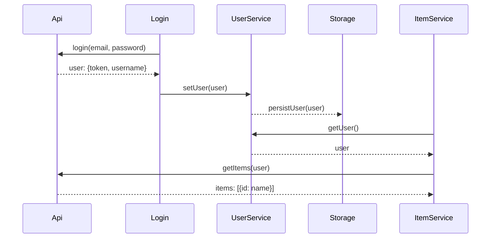

```mermaid
sequenceDiagram
    Participant a as Api
    Participant l as Login
    Participant u as UserService
    Participant s as Storage
    Participant i as ItemService

    l->>a: login(email, password)
    a-->>l: user: {token, username}
    l->>u: setUser(user)
    u-->>s: persistUser(user)
    i->>u: getUser()
    u-->>i: user
    i->>a: getItems(user)
    a-->>i: items: [{id: name}]
```